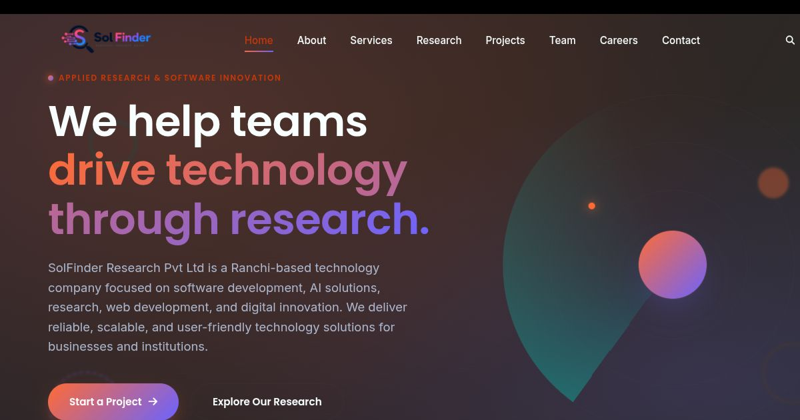
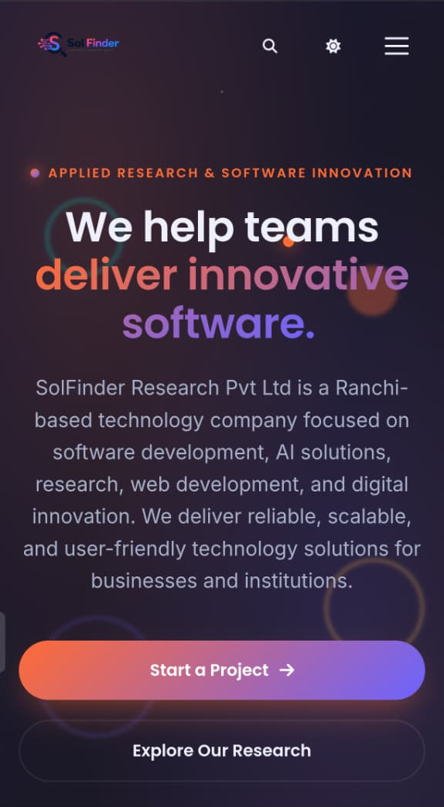

<div align="center">

# SolFinder Research

### Modern Corporate Technology Website

A responsive, accessible, and modern corporate website developed during an internship program to showcase a technology company's services, research initiatives, projects, careers, and organizational profile.

<p>
  <a href="https://solfinder-research.vercel.app"></a>
  <a href="https://github.com/Aman-kumar2006/SolFinder-Research"></a>
  <!-- <a href="LICENSE_LINK"></a> -->
</p>

<p>


</p>

</div>

---

## Preview

| Desktop | Mobile |
|----------|--------|
|  |  |

---

## Table of Contents

- About
- Features
- Technology Stack
- Project Structure
- Website Pages
- Responsive Design
- Installation
- Usage
- Objectives
- Future Improvements
- Team
- Learning Outcomes
- Contributing
- License
- Author

---

# About

**SolFinder Research** is a professional corporate website built using modern frontend technologies. The project presents an organization's research activities, technology solutions, company profile, project portfolio, recruitment opportunities, and contact information through an intuitive and responsive interface.

The primary objective was to apply modern frontend development principles while delivering a production-ready static website emphasizing responsiveness, accessibility, maintainability, and user experience.

---

# Features

### User Experience

- Modern corporate landing page
- Responsive navigation
- Mobile-first layout
- Smooth scrolling
- Scroll reveal animations
- Interactive UI components
- Back-to-top button
- Clean typography
- Professional card layouts
- Dark themed interface

### Company Sections

- Company Overview
- Services
- Research & Publications
- Project Portfolio
- Team Members
- Career Opportunities
- Contact Page
- FAQ
- Privacy Policy
- Terms & Conditions
- Custom 404 Page

### Technical Features

- Semantic HTML5
- Responsive CSS3 Layout
- Vanilla JavaScript
- Cross-browser compatibility
- Modular file organization
- Lightweight implementation
- Optimized assets
- Maintainable codebase

---

# Technology Stack

| Technology | Purpose |
|------------|---------|
| HTML5 | Semantic markup |
| CSS3 | Styling & responsive layouts |
| JavaScript (ES6) | Interactive functionality |
| Font Awesome | Icons |
| Google Fonts | Typography |


---

# Website Pages

| Page | Description |
|------|-------------|
| Home | Company overview and hero section |
| About | Vision, mission and company information |
| Services | Technology services and solutions |
| Research | Research activities and publications |
| Projects | Portfolio of completed projects |
| Team | Organization and internship members |
| Careers | Recruitment information |
| Contact | Contact details and inquiry form |
| FAQ | Frequently asked questions |
| Privacy Policy | Privacy information |
| Terms & Conditions | Terms of website usage |
| 404 | Custom error page |

---

# Responsive Design

The interface is optimized for multiple screen sizes.

| Device | Supported |
|----------|-----------|
| Desktop | Yes |
| Laptop | Yes |
| Tablet | Yes |
| Mobile | Yes |

---

# Objectives

- Build a professional corporate website
- Practice responsive web development
- Apply semantic HTML principles
- Improve frontend engineering skills
- Enhance UI/UX implementation
- Implement interactive JavaScript components
- Follow modern development practices
- Strengthen collaborative development workflows

---

# Future Improvements

- Backend integration
- Authentication system
- Admin dashboard
- CMS integration
- Database connectivity
- REST API support
- Search functionality
- Blog management
- Live chat
- Analytics dashboard
- Contact form backend
- Performance optimization
- Progressive Web App (PWA)

---

# Team

| Member | Responsibility |
|---------|----------------|
| Aman Kumar | Team Lead & Frontend Development |
| Prince | UI/UX Design |
| Sumit | Frontend Development |
| Rahul | JavaScript Development & Testing |
| Pratik | Content & Documentation |

---

# Learning Outcomes

This project provided practical experience with:

- HTML5
- CSS3
- JavaScript (ES6)
- Responsive Web Design
- UI/UX Principles
- Accessibility
- Frontend Architecture
- Website Optimization
- Git & GitHub
- Team Collaboration
- Project Documentation

---


# License

This project was developed for educational and internship purposes.

See the **LICENSE** file for more information.

---

# Author

**Aman Kumar**

GitHub: **https://github.com/aman-kumar2006/solfinder-research**


---

## Repository Topics (GitHub)

```
html
css
javascript
frontend
responsive-design
corporate-website
landing-page
company-website
portfolio
internship-project
web-development
ui-ux
frontend-project
static-website
technology
research
website-template
responsive-ui
vanilla-javascript
html-css
```
